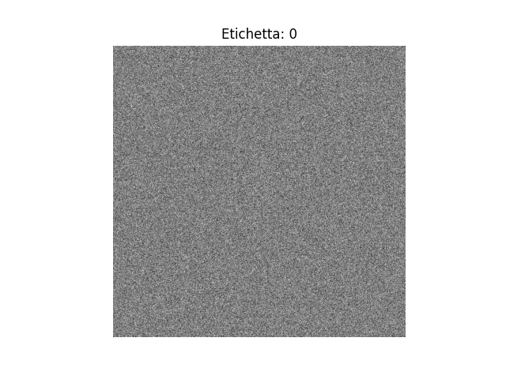
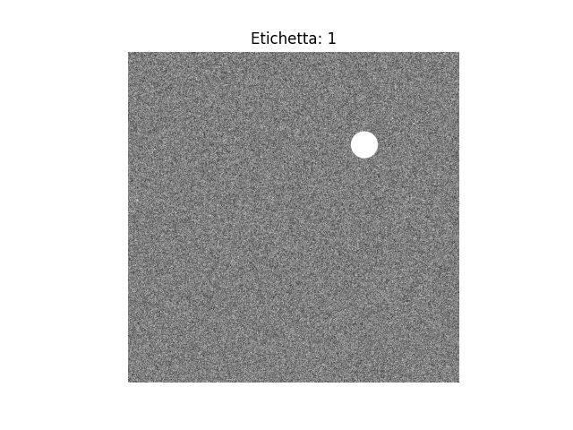

# Introduzione

This project aims to explore the feasibility of training a Convolutional Neural Network with a very limited quatity of images and verify that it can be applied to medical images.
We will training an CNN with 100 sintetic image and we will apply the GradCAM library to see if the network pay attention to the object of interest.
## Dataset
The dataset is composed of synthetic images generated specifically for training. Each image starts as a random noise background, to which a circular shape is added in a subset of cases. The radius of each circle is randomly selected within a predefined range, simulating a region of interest.

To make the task more realistic and prevent the model from overfitting on simple visual patterns, we also inject additional noise within the circle itself.
you can visualize the entire dataset [here](https://github.com/GiovanniGueltrini/PROVA_CNN-for-Image-Analysis-/tree/main/image/immagini)
## Model

To create the model I got inspired by the ResNet netwotk's.
The Network is composed by 8 block, each block is made by two sub-block: 
1. Convolution Block: reduces the spatial dimension by convolution with stride 2, and applies dropout and batch normalization.
2. Identity Block: keeps the same size, adding a second convolutional step.

In the end of the network there is a classificator form by two fully connected layer.

  
  

## GradCam and Segmentation
### Gradcam
To understand which regions of the image the model focuses on when making a decision, we applied Grad-CAM (Gradient-weighted Class Activation Mapping) — a popular technique for visualizing the inner workings of convolutional neural networks.

We used the pytorch-grad-cam library, which allows for easy integration of Grad-CAM into any PyTorch model.
it uses the gradients of the target class flowing into the final convolutional layer to produce a coarse localization map, highlighting the important regions in the image.
As shown in the image, the model seems to concentrate on the relevant area where the object is located.

### segmentation
The model was only trained to detect whether the object is present or absent in the image.
Nevertheless, we leveraged the Grad-CAM heatmap to approximate the object's location.
To do so, we applied a threshold to identify the most relevant pixels—
the full process is detailed here.

To evaluate how well this method can predict the object’s position,
we assessed the quality of the resulting segmentation using  [Sørensen-Dice coefficient](https://en.wikipedia.org/wiki/Dice-S%C3%B8rensen_coefficient)
